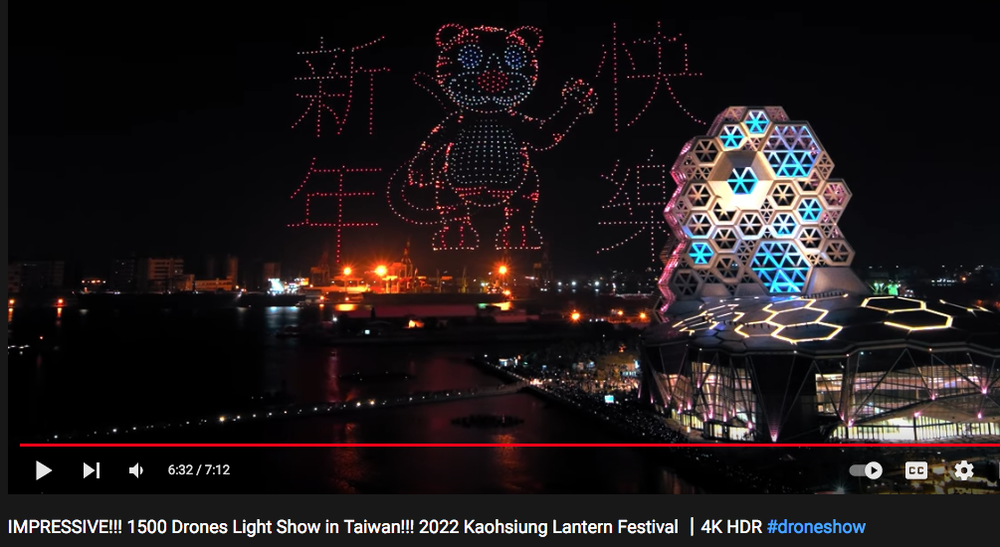
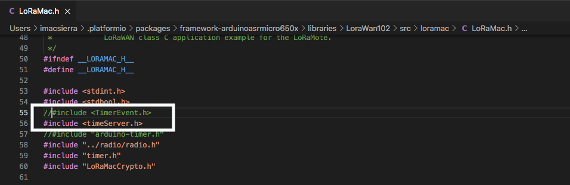

# LoRa_ClusterDucks  
Some LoRa projects w/ ClusterDuck-Protocol

## How Does Ducks Work? (鴨子們怎麼幹活？) 
 
 
  
  
ESP32 TTGO Lora32 w/ ClusterDuck  
  

MamaDuck got data from AlienDuck(ArduinoLora)...  
  
 
MamaDuck got data from DuckLink...
 

  

CubeCell ASR650X DuckLink  
TimerEvent_t issue? Try this:

 
