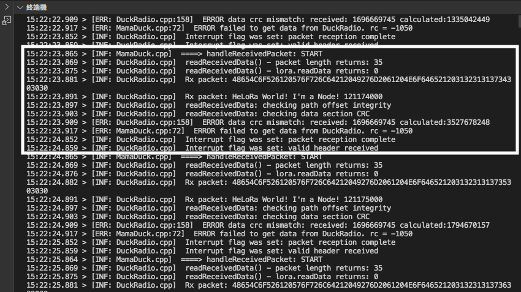
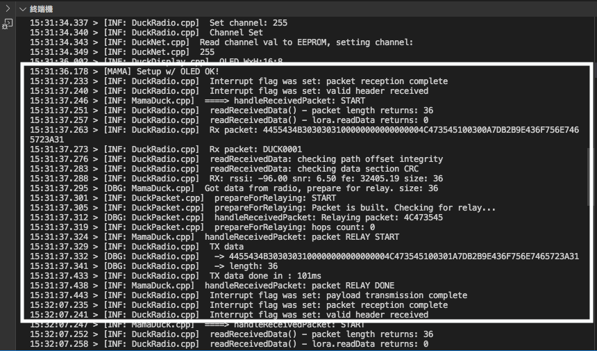

# LoRa_ClusterDucks  
Some LoRa projects w/ ClusterDuck-Protocol

## How Does Ducks Work?  
 
 
  

## ESP32 TTGO Lora32 w/ ClusterDuck
MamaDuck got data from AlienDuck(ArduinoLora)...

  
MamaDuck got data from DuckLink...
 

  
