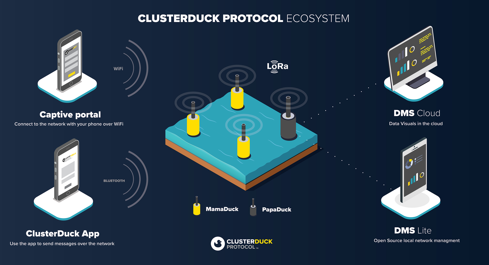
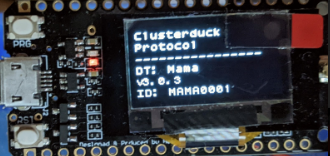

# LoRa_ClusterDucks  
Some LoRa projects w/ ClusterDuck-Protocol

## How Does Ducks Work? (鴨子們怎麼幹活？) 

  

## ESP32 TTGO Lora32 w/ ClusterDuck  

MamaDuck got data from AlienDuck(ArduinoLora)...

 
MamaDuck got data from DuckLink...
 

  
